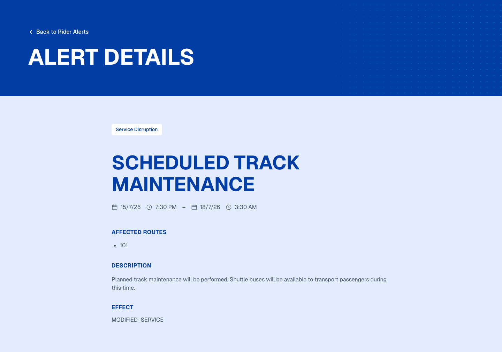
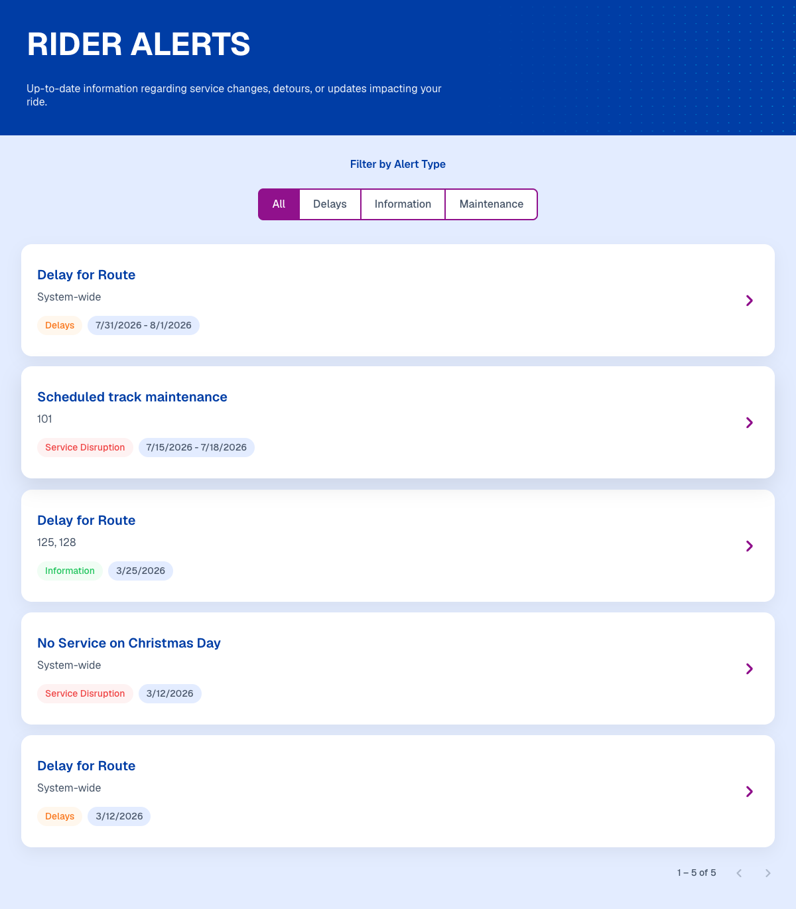
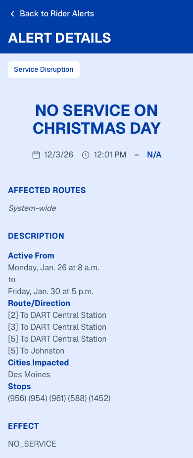

# Rider Alerts

A two-screen transit-alerts feature built with **Angular 21** for the Exemplifi coding test.

- `/alerts` — list of rider alerts with type filter and client-side pagination
- `/alerts/:id` — full details for a single alert with sanitized rich-text description

Repository: https://github.com/abhjitmalvadkar/rider-alerts

---

## Setup & run

Prerequisites: **Node 20.19+ or 22.12+**, **npm 10+**.

```bash
npm install
npm start              # → http://localhost:4200
npm run build          # production build → dist/rider-alerts
```

`npm start` runs `concurrently -k -n TW,NG` — Tailwind pre-compile in watch mode alongside `ng serve`.

---

## Screenshots

### List page

| Desktop (1440 × 900) | Mobile (390 × 844) |
|---|---|
|  |  |

### Details page

| Simple alert (desktop) | Rich alert with sub-sections (desktop) | Rich alert (mobile) |
|---|---|---|
|  |  |  |

### Empty state (filter with no matches)


---

## Stack

- Angular 21 · standalone components · signals · `@if` / `@for` / `@switch` · OnPush everywhere
- NgRx 21 (`Store`, `Effects`) for state
- Angular Material `MatIcon` (SVG registry) + `MatProgressSpinner`
- Tailwind v4 pre-compiled via `@tailwindcss/cli` (Angular's esbuild builder doesn't process `postcss.config.js`)
- SCSS with CSS custom properties for design tokens
- `62.5%` root font-size trick — **1rem = 10px**

---

## Architecture

### Folder structure (tummy-fuel convention)

```
src/
├── public/                        (Angular 17+ public assets — served at root)
│   ├── Alerts-List.json
│   ├── Alerts-Type.json
│   ├── header-vector.png
│   └── icons/                     (chevron-left, chevron-right, calendar, clock, ...)
├── styles.scss                    (design tokens, base, shared classes)
├── tailwind.css                   (Tailwind theme + custom breakpoints)
└── app/
    ├── app.component.{ts,html}
    ├── app.config.ts              (router, HttpClient, root store, effects, devtools)
    ├── app.routes.ts              (/ → /alerts redirect, lazy feature, catch-all)
    ├── material.providers.ts      (SVG icon registry)
    ├── features/alerts/
    │   ├── alerts.routes.ts       (lazy feature — provideState + provideEffects here)
    │   ├── core/                  (NgRx + service + model + mapper co-located)
    │   │   ├── alerts.action.ts
    │   │   ├── alerts.effects.ts
    │   │   ├── alerts.mapper.ts
    │   │   ├── alerts.model.ts
    │   │   ├── alerts.reducer.ts
    │   │   ├── alerts.selectors.ts
    │   │   └── alerts.service.ts
    │   ├── alerts-list-screen/
    │   ├── alert-details-screen/
    │   ├── not-found-screen/
    │   └── components/
    │       ├── alert-card/
    │       ├── alert-filter-bar/
    │       ├── alert-list/
    │       ├── alert-pagination/
    │       └── list-states/       (empty-state, error-state)
    └── shared/
        ├── components/
        │   ├── global-loader/     (fullscreen spinner overlay)
        │   ├── layout-wrapper/    (header + router-outlet + loader)
        │   └── page-header/
        ├── constants/
        │   └── urls.constants.ts  (v1URL — { url, method } per endpoint)
        ├── core/                  (global NgRx slice for loader)
        │   ├── shared.actions.ts  (StartLoading, StopLoading, ClearLoading)
        │   ├── shared.reducer.ts  (loading: number[] — stack pattern)
        │   └── shared.selectors.ts
        ├── pipes/
        │   ├── date-range.pipe.ts
        │   ├── safe-html.pipe.ts
        │   └── strip-html.pipe.ts
        └── services/
            └── common.service.ts  (callAPI wrapper + startLoading/stopLoading)
```

### NgRx flow

```
Component  ──dispatch──▶  Action  ──▶  Effect  ──▶  Service (callAPI)
   ▲                                     │              │
   │                                     ▼              ▼
   └───selectSignal───  Selector ◀── Reducer ◀── Success/Failure Action
```

- **Action** — `const NAME = "[alerts] fetch ..."; export const Name = createAction(NAME, props<...>())`
- **Effect** — `mergeMap` + `startLoading()` `tap` on entry + `stopLoading()` `tap` after both success & failure; sorts alerts DESC by `effectiveDate`
- **Service** — calls `commonService.callAPI(method, url)` with URL config from `v1URL` constants
- **Reducer** — split slices (`alertsList`, `alertDetails`, `alertTypes`, `filter`, `page`)
- **Global loader** — separate `shared` slice with a `loading: number[]` stack; overlay shown while length > 0

### URL as source of truth

Filter and page are synced to query params: `/alerts?type=<id|all>&page=<n>`. The list screen reads them via `toSignal(queryParamMap)`, dispatches `SetFilter` / `SetPage`, and every interaction navigates to update the URL. Refresh, deep-link, and browser-back all work.

### Lazy loading

Root `app.routes.ts` lazy-loads `/alerts` via `loadChildren`. The feature route registers its own NgRx slice with `provideState(...)` + `provideEffects(...)` — so state and effects load only when the user enters the feature.

### Details `:id` binding

`withComponentInputBinding()` is configured in `app.config.ts`, so the `:id` route param binds directly to `input.required<number, unknown>({ transform: numberAttribute })` on the details component. No `paramMap.subscribe` needed.

### Styling system

- **Design tokens** — CSS custom properties in `styles.scss` (`--color-brand`, `--color-accent`, `--radius`, `--shadow`, ...).
- **Tokens available to Tailwind** — mirrored in `tailwind.css` under `@theme`.
- **Split** — Tailwind for layout / spacing / responsive; SCSS for typography / colors / hover / transitions. All spacing values use `[X.Xrem]` arbitrary utilities (e.g. `p-[1.6rem]`) — no `gap-4` / `p-8` short-form.
- **Breakpoints** (mirror tummy-fuel):

  | Prefix | Range           |
  |--------|-----------------|
  | `xs:`  | max 599.98 px   |
  | `sm:`  | ≥ 600 px        |
  | `md:`  | ≥ 960 px        |
  | `lg:`  | ≥ 1280 px       |
  | `xl:`  | ≥ 1920 px       |

  Figma values live at `lg:` (desktop). Everything scales down for `md` / `sm` / mobile.

---

## Assumptions

1. **Static JSON data source.** No real backend — data is served from `public/Alerts-List.json` and `public/Alerts-Type.json`. The `CommonService.callAPI` wrapper still uses `HttpClient` internally so swapping to a real API is a URL change only.
2. **Filter is by `alertTypeId`.** Matches the ids in `Alerts-Type.json`. Figma showed type-labeled filter pills; we drove the labels from the types file.
3. **Sort order.** Alerts are sorted DESCENDING by `effectiveDate` inside the effect (newest first). Rationale: riders care about current/recent alerts first.
4. **Pagination is client-side.** Five per page. The `totalPages` / `hasNextPage` fields in the JSON are ignored — page count is computed from the actual list length so it scales with the dataset.
5. **"Ongoing" alerts** (no `expirationDate`) render as `N/A` in the meta row.
6. **Descriptions may contain rich HTML.** Rendered with `SafeHtmlPipe` + `DomSanitizer.bypassSecurityTrustHtml`. Sub-section `<h2>` headings inside the description get styled to Geist / 600 / 20px / 140% line-height, with 32 px gap between sub-sections.
7. **Alert type colors** ship in the data (`alertTypeColor` / `alertTypeTextColor`) and drive the list card's type pill only. The details page badge uses static brand-on-white styling so the two treatments are visually distinct.

---

## Enhancements beyond the requirements

- **Lazy-loaded feature module** — routes + state + effects all deferred until `/alerts` is entered.
- **Global loading indicator** — stack-based (`number[]`), dispatched from every effect via `commonService.startLoading()` / `stopLoading()`. Multiple concurrent requests are handled correctly.
- **URL-driven state** — filter + page live in query params; refresh / deep-link / browser-back all preserve state.
- **Details focus management** — page moves focus to the `<h2>` title after data loads, with `tabindex="-1"` and visible focus outline.
- **Windowed filter bar** — up to 5 pills visible at once (4 at md, 3 at sm, 2 on mobile), with prev/next chevrons that appear on hover (`:focus-within` for keyboard).
- **Empty & error states** — dedicated components; empty state has "Show all alerts" recovery action.
- **Keyboard navigation** — arrow keys move focus between filter tabs (Home/End too); Enter/Space activate all `role="button"` elements.
- **Accessibility** — `aria-label`, `aria-pressed`, `aria-disabled`, `aria-live` polite region for the result count, `aria-hidden` on decorative icons, `.sr-only` utility.
- **Responsive** — five-tier breakpoint system, mobile-first, tested `xs` → `xl`.
- **Design tokens** — colors, radii, shadows, spacing all in CSS custom properties so a rebrand is a token change.
- **SVG icon registry** — six icons registered once via `MatIconRegistry` + `DomSanitizer`; components consume via `<mat-icon svgIcon="chevron-right"/>`.

