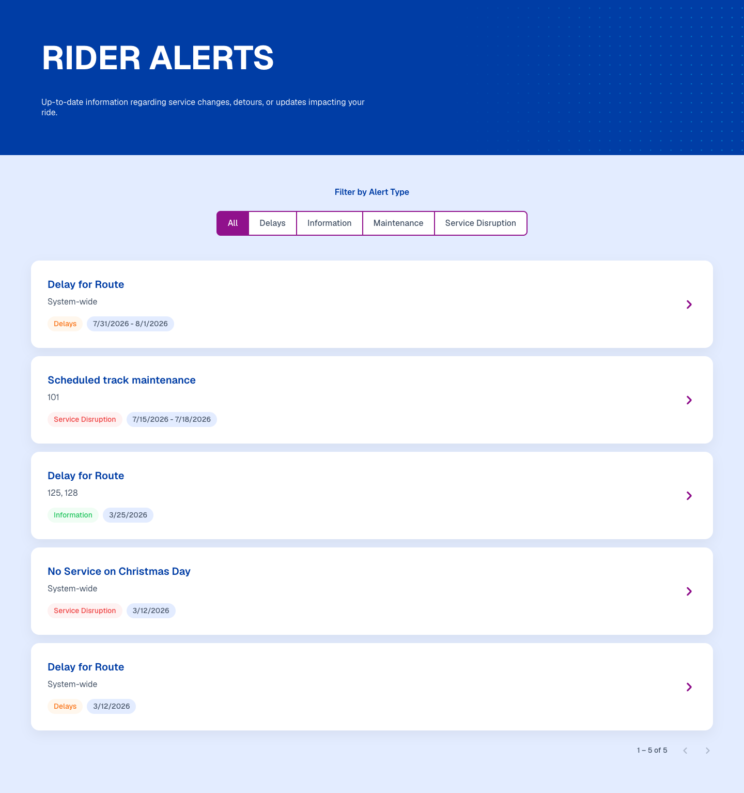
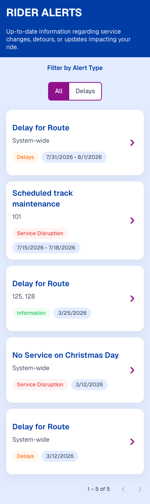
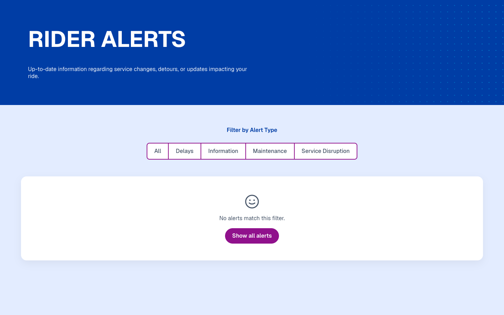

# Rider Alerts

A two-page transit-alerts feature built in Angular 21 for the Exemplifi coding test.

* `/alerts` — list of rider alerts with type-filter tabs and 5-per-page client-side pagination
* `/alerts/:id` — full details for a single alert with sanitized rich-text description

## Setup & run

Prerequisites: **Node 20.19+ or 22.12+** and **npm 10+**.

```bash
npm install
npm start          # http://localhost:4200 (dev server, live reload)
npm test           # Vitest — one-off run
npm run build      # production build → dist/rider-alerts
```

## Screenshots

*(Placeholders — add PNGs into `docs/screens/` and reference them here before submission.)*

| List (desktop) | List (mobile) | Details | Empty state |
|---|---|---|---|
|  |  |  |  |

## Architecture & rationale

**Stack.** Angular 21 · standalone components · signals · new control flow (`@if` / `@for` / `@switch`) · OnPush everywhere · TypeScript strict · SCSS + Tailwind v4 · Vitest.

**State — NgRx.** A single feature-level slice (`src/app/features/alerts/store/`) with actions, reducer, selectors, and effects. Consumed inside components via `store.selectSignal(...)`, so the pages stay signals-first while the store handles all side-effects. NgRx was chosen deliberately to show fluency with the pattern — it also demonstrates the "signals + RxJS bonus": the store is Rx internally, the components see only signals.

**HTTP — direct `HttpClient`.** The `AlertService` calls `HttpClient` directly rather than routing through an interceptor pipeline. The data source is two static JSON files in `src/assets/`, which need none of the auth / loading / error interceptor behaviour a real API would (see *Deviations* below). The service caches the alerts list with `shareReplay({ bufferSize: 1, refCount: false })` so `getAlertById(id)` doesn't re-fetch.

**Routing.** Lazy-loaded feature module. The alerts feature registers its own state and effects at the route boundary via `provideState` / `provideEffects`, so both the slice and its effects load only when the user enters `/alerts`. `withComponentInputBinding()` binds the `:id` route param straight to a signal `input()` on the details page.

**URL as source of truth.** Filter and page are synced to query params: `/alerts?type=<id|all>&page=<n>`. The list page reads the params on init (and reactively via `toSignal(queryParamMap)`), dispatches `setFilter` / `setPage`, and every user interaction navigates to update the params. Refresh, deep-link, and browser-back all Just Work.

**Component split.** `alerts-list-page` is the smart container. It composes four presentational sub-components (all standalone, OnPush, signal inputs/outputs):

* `alert-filter-bar` — pill tabs with `aria-pressed` and arrow-key nav
* `alert-card` — clickable card (`<button>`), colored data-driven badge + neutral date pill
* `alert-pagination` — Previous / current-of-total / Next with correct disabled states
* `list-states/{skeleton-list, empty-state, error-state}` — all four UI states (loading skeleton, success, empty, error+retry)

**Rendering the HTML description.** The list card strips HTML to a short plain-text summary (`StripHtmlPipe`). The details page sanitizes and renders the full HTML (`SafeHtmlPipe`, backed by `DomSanitizer.bypassSecurityTrustHtml`).

**Focus management.** Details page moves focus to the `<h2>` title (`tabindex="-1"`) once the alert resolves. Cards are `<button>`s so they participate in the natural tab order. Filter tabs support arrow-key movement.

## Deviations from the assignment / starter

* **Direct `HttpClient`** instead of the starter's `BaUtilityService.callAPI` convention — static mock JSON in `assets/` doesn't need auth tokens or loader queue, and the layer would just be noise.
* **`app-` selector prefix, no `ba-`.** The starter's `ba-` shared components (icon, dialog, buttons, etc.) were stripped entirely; the alerts feature is self-contained under `app-`.
* **Colored type badge** in both the list card and the details page. The Figma showed a neutral pill — colored surfaces the `alertTypeColor` / `alertTypeTextColor` shipped in the data.
* **Filter is driven by `Alerts-Type.json`** and matches `alertTypeId`. The Figma mock used effect-based labels against a richer real dataset; the assignment says filter by type, so we follow the data.
* **Stale pagination metadata ignored.** The mock file claims `totalCount: 18 / totalPages: 4` but ships 5 items — pagination is computed client-side from the actual `items.length` and scales automatically when the dataset grows.
* **Chrome colors sampled from the Figma** and stored as CSS custom properties in `src/styles.scss` (see `--color-brand`, `--color-accent`, etc.). Badge colors stay inline styles from the data.
* **Starter cleanup.** Everything unrelated to the alerts feature was deleted: authentication, products, profile, samples, layouts, guards, HTTP interceptors, and all `ba-*` shared code. Only build config, environments, style-token infra, PostCSS/Tailwind wiring, and Vitest setup were kept.

## Project structure

```
src/
├── assets/
│   ├── Alerts-List.json
│   └── Alerts-Type.json
├── index.html                 (Oswald + Inter fonts)
├── styles.scss                (design tokens as CSS variables, Tailwind theme)
└── app/
    ├── app.ts / .html / .scss / .spec.ts
    ├── app.config.ts          (router, HttpClient, root Store/Effects, devtools)
    ├── app.routes.ts          (redirect / → /alerts, lazy alerts feature, catch-all)
    └── features/alerts/
        ├── alert.service.ts   (HttpClient direct, shareReplay-cached)
        ├── alerts.routes.ts   (provideState + provideEffects at the route boundary)
        ├── models/
        │   ├── alert.model.ts (domain + raw API types + FilterValue)
        │   └── alert.mapper.ts
        ├── pipes/
        │   ├── strip-html.pipe.ts
        │   ├── date-range.pipe.ts
        │   └── safe-html.pipe.ts
        ├── store/
        │   ├── alerts.actions.ts
        │   ├── alerts.reducer.ts
        │   ├── alerts.selectors.ts
        │   └── alerts.effects.ts
        └── pages/
            ├── alerts-list-page/
            │   ├── alerts-list-page.component.{ts,html,scss}
            │   └── components/{alert-card, alert-filter-bar, alert-pagination, list-states}/
            ├── alert-details-page/
            └── not-found-page/
```

## Testing

Vitest runs via `@angular/build:unit-test` (no Karma). `npm test` runs all specs once.

35 specs across 9 files cover:

* **Mapper** — key renames, null expiration, empty routes
* **Pipes** — `StripHtmlPipe` (tags, entities, truncation, null-safety), `DateRangePipe` (single/range/Ongoing)
* **Reducer** — status transitions, `setFilter` resets page, `setPage`
* **Selectors** — `selectFilterOptions` prepends *All*; `selectFilteredAlerts`, `selectPagedAlerts` (page size 5 across 7 items = 2 pages), `selectTotalPages`, `selectResultCount`
* **Service** — `HttpTestingController`, request URLs, `getAlertById` cache-hit (no second HTTP request)
* **Components** — `AlertCard` renders title/routes/badge, emits on click, shows *System-wide* when routes empty; `AlertPagination` boundary disable states and page-change emission

## Accessibility

* Semantic landmarks (`header` / `main` / `nav`), one `<h1>` per page.
* Filter tabs: buttons with `aria-pressed`, arrow-key movement.
* Cards are `<button>`s — Enter/Space activate naturally, visible focus ring (via global `:focus-visible`).
* Details page moves focus to `<h2>` on load.
* Live region announces result count / current page on filter/pagination change.
* Respects `prefers-reduced-motion`.
* Touch targets ≥ 44 px.

## Responsive

Mobile-first via Tailwind + media queries.

* **Mobile (<640):** single-column cards, filter pills wrap, reduced header padding.
* **Tablet (640–1024):** wider column, comfortable spacing.
* **Desktop (>1024):** centered `max-w-[1040px]` container, Figma alignment.

## What I'd do with more time

* Real API + server-side pagination endpoint (drop `shareReplay` cache for that).
* i18n (currently English-only, dates hard-coded to en-US format).
* Playwright e2e (list → click card → details → back).
* Route resolver for details so the page can render synchronously without a "loading" flash when navigated from the list.
* Dark-mode tokens.
